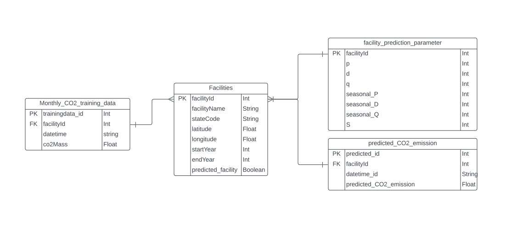

# Aseye | Carbon Emission Tracker/Predictor Data Engineering Project

## Introduction

Aseye's goal is to create a software data platform that can be used to analyze carbon emissions from facilities in USA. It can automate extracting data from the EPA, store the data in GCP, create an apply a prediction model of the carbon emission for each facility, and update the dashboard autonomously.

## Pipeline 

1. Retrieve emissions and facility data from EPA
2. Store raw data in Google Cloud Storage 
3. Extract raw data and transform it using Mage-AI
4. Create prediction model using transformed data from step above
5. Store data into Google BigQuery
6. Create data visualization using Google Looker Studio

## Dataset Sources
Dataset can be retrieved using the EPA API: https://www.epa.gov/ 

## Data Model

## Data Visualization
The current dashboard can seen in the URL below:
https://lookerstudio.google.com/reporting/39033543-ec73-453f-8087-11cd2157d22f
Note:
Historical data: Jan 2012 - Dec 2021
Prediction: Jan 2022 - Dec 2022
Only added 3 states (AL, CA, FL) due to large dataset. Waiting for Mage increase capacity of extraction
